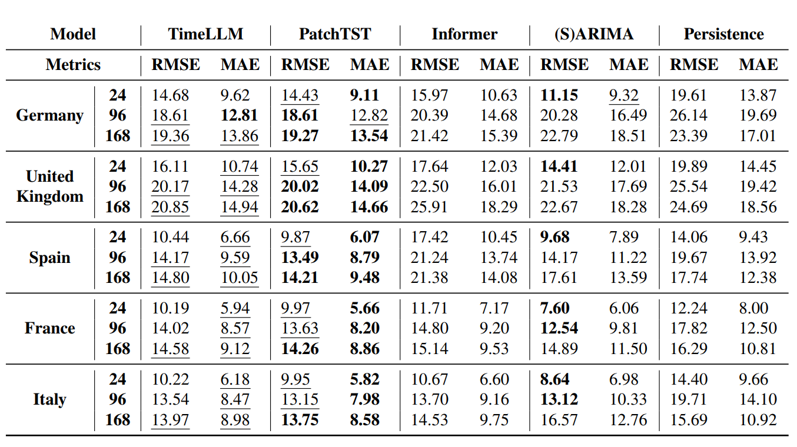

# Analysis of modern AI models for time series forecasting in energy domain

**Type:** Master's Thesis 

**Author:** Valentyna Riabchuk

**1st Examiner:** Prof. Dr. Stefan Lessmann 

**2nd Examiner:** Dr. Alona Zharova 




Results scaled by a factor of 10². The best results are highlighted in bold, and the second-best results are underscored.

## Table of Contents

- [Abstract](#abstract)
- [Working with the repo](#Working-with-the-repo)
    - [Dependencies](#Dependencies)
    - [Hardware requirements](#hardware-requirements)
    - [Setup](#Setup)
- [Training code](#Training-code)
- [Project structure](-Project-structure)

## Abstract

Long-sequence time series forecasting plays a crucial role in the energy sector. It provides future values for metrics that cannot be planned, relying on patterns from historical data. In our work, we apply the new PatchTST and TimeLLM models to three domains: load, solar power generation, and wind power generation, and compare them to the SOTA Informer model, (seasonal) ARIMA, and persistence forecasts across three forecasting horizons: 24, 96, and 168 hours, and five countries: Germany, the United Kingdom, Spain, France, and Italy. In addition, we perform ablation experiments on components of the PatchTST architecture. 
The results show that PatchTST outperforms all models in MAE across all countries and prediction lengths, but (S)ARIMA still outperforms other models in RMSE for 24-hour forecasts and for France and Italy in 96-hour forecasts. The ablation study revealed that all components of PatchTST contribute to its forecasting accuracy, with RevIN being the most important for data with significant scale shifts between train and test datasets. RevIN also helps mitigate daily, weekly, and seasonal variations during the training. Therefore, the model forecasts equally well for all days of the week and seasons. Channel independence allows the model to benefit from longer input windows and to learn local temporal patterns from individual features. Patching enhances prediction accuracy by extracting local information effectively and significantly speeds up the training process. TimeLLM with the GPT-2 backbone cannot surpass PatchTST. It is the second-best model because it incorporates advantageous components from PatchTST.

**Keywords**: Long-sequence time series forecasting, PatchTST, TimeLLM, Load, Solar power generation, Wind power generation, TSO

## Working with the repo

### Dependencies

The code was run on Python 3.11. The dependencies require Python >=3.8.

### Hardware requirements

All experiments with Deep Learning models were conducted on remote servers using Nvidia RTX A6000 GPU (48 GB). Most experiments for Informer and PatchTST (except the ablation study with patching) can be run on less powerful GPUs (e.g., with 4 GB of RAM).
TimeLLM was executed using 4 Nvidia RTX A6000 GPUs in multiprocessing mode, with each GPU requiring 7 GB of RAM. However, it can be run as a single process on one GPU. The line for this option is provided in the code.

### Setup

1. Clone this repository

2. Create an virtual environment and activate it
```
python -m venv thesis-env
source thesis-env/bin/activate
```

3. Install requirements
```bash
pip install --upgrade pip
pip install -r requirements.txt
```

## Training code 

NOTE: In notebooks 3 and 4 change to your cuda device: ```cuda_device = "0"```. If you have only one cuda device, just comment this line: 

```bash
os.environ["CUDA_VISIBLE_DEVICES"] = cuda_device
```


1. The non-preprocessed dataset "time_series_60min_singleindex.csv" is in the folder ./datasets. The data used for our research originates from the Open Power System Data platform. It consists of hourly measurements of load, solar, and wind power generation (in megawatts) ranging from 2015 to the end of September 2020. 

    The pre-processed datasets are provided in the same ./datasets folder. They are saved as "DE_data.csv", "ES_data.csv", "FR_data.csv", "GB_data.csv", "IT_data.csv". In other words, you do not need to execute these notebooks to obtain the datasets. You can directly start from notebooks "2". However, you can review the data preparation steps and data characteristics at .ipynb files: 1a, 1b and 1c.

2. The notebook 2.Base_models.ipynb provides code for persistence forecasting and (seasonal) ARIMA. The latter is fitted in univariate settings: the load and solar power generation columns are fitted with seasonal ARIMA (with a seasonal parameter of 24 hours), while the wind power generation columns are fitted with ARIMA without a seasonal parameter.

3. 3a.Informer_PatchTST.ipynb is a notebook containing the main experiments for Informer and supervised PatchTST. The latter is trained with three input windows (168, 336, 512), and the best input windows form the final results for PatchTST.

    In 3b.PatchTST_self_supervised.ipynb is the code to execute self-supervised PatchTST. It consists of two stages: pre-training (reconstructing patches) and fine-tuning to the target task.

    3c.Experiments_with_PatchTST.ipynb includes the experiments, where individual components of PatchTST are omitted while the others remain enabled, testing them one by one (ablation study). These components include RevIN, channel independence, and patching. In addition, there is an experiment with trend decomposition (please refer to DLinear paper for more details).

4. TimeLLM_multi.ipynb contains code to train TimeLLM with multiprocessing on 4 GPUs. You can run it on a single GPU by replacing the line:

```bash
python -m accelerate.commands.launch --mixed_precision bf16 --multi_gpu --num_processes=4 --num_machines 1 --dynamo_backend "no"  --main_process_port "01025" ./Time-LLM/run_main.py \
```

with:

```bash
python -m accelerate.commands.launch --mixed_precision bf16 --num_processes=1 --num_machines 1 --dynamo_backend "no" --main_process_port "01025" ./Time-LLM/run_main.py \
```

## Project structure

```bash
├── 1a.Data_selection.ipynb                 # First look at datasets and first data preparation steps (e.g. missing values imputation)
├── 1b.Data_analysis.ipynb                  # EDA
├── 1c.Data_preparation.ipynb               # Creation of country-based datasets
├── 2.Base_models.ipynb                     # Implementation of persistence forecast and (seasonal) ARIMA
├── 3a.Informer_PatchTST.ipynb              # Notebook to run Informer and supervised PatchTST
├── 3b.PatchTST_self_supervised.ipynb       # Notebook to run self-supervised PatchTST 
├── 3c.Experiments_with_PatchTST.ipynb      # Notebook to run ablation study + TS trend decomposition
├── 4.TimeLLM_multi.ipynb                   # Notebook to run TimeLLM 
├── 5.Results_comparison.ipynb              # Final tables, figures and calculations
├── A_1a.Scaler_choice.ipynb                # APPENDIX
├── A_1b.Scaler_choice_IT.ipynb             # APPENDIX
├── A_1c.Scaler_choice_Comparison.ipynb     # APPENDIX
├── A_1d.Scaler_choice_Comparison_IT.ipynb  # APPENDIX
├── datasets                                # Directory with all datasets
├── logs                                    # Training logs
├── NOTICE.txt                              # Links to original PatchTST and TimeLLM folders
├── PatchTST-main                           # PatchTST directory 
├── requirements.txt                        # Required dependencies
├── results                                 # .csv files with results 
├── Time-LLM                                # TimeLLM directory 
└── utils                                   # Functions for EDA, and other helper functions
```
